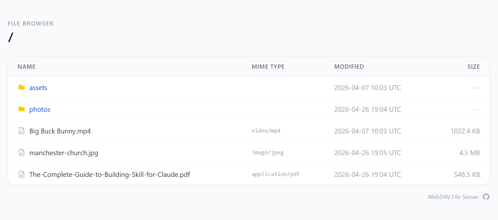

# WebDAV Server

A minimal WebDAV server.



## Features

- WebDAV protocol support (PROPFIND, GET, PUT, DELETE, MKCOL, COPY, MOVE, etc.)
- Directory browsing in the browser
- Basic auth and Google OIDC for authentication

## Environment Variables

| Variable                      | Description                                                      |
| ----------------------------- | ---------------------------------------------------------------- |
| `WEBDAV_DIR`                  | **(Required)** Path to the directory to serve                    |
| `WEBDAV_PORT`                 | Port to listen on (default: `8080`)                              |
| `WEBDAV_NO_AUTH`              | Set to any value to disable authentication                       |
| `WEBDAV_USERNAME`             | Basic auth username                                              |
| `WEBDAV_PASSWORD`             | Basic auth password                                              |
| `WEBDAV_GOOGLE_CLIENT_ID`     | Google OAuth2 client ID                                          |
| `WEBDAV_GOOGLE_CLIENT_SECRET` | Google OAuth2 client secret                                      |
| `WEBDAV_GOOGLE_REDIRECT_URL`  | OAuth2 redirect URL (e.g. `http://localhost:8080/auth/callback`) |
| `WEBDAV_EMAIL_WHITELIST`      | Comma-separated list of allowed Google account emails            |

## Authentication Modes

| Mode         | Variables set                                       | Who can access                                  |
| ------------ | --------------------------------------------------- | ----------------------------------------------- |
| No auth      | `WEBDAV_NO_AUTH`                                    | Everyone                                        |
| Basic auth   | `WEBDAV_USERNAME` + `WEBDAV_PASSWORD`               | WebDAV clients and browsers                     |
| Google OIDC  | Google vars                                         | Browser only                                    |
| Basic + OIDC | Google vars + `WEBDAV_USERNAME` + `WEBDAV_PASSWORD` | Browser via OIDC, WebDAV clients via basic auth |

## Usage

### No authentication

```bash
export WEBDAV_DIR=/path/to/files
export WEBDAV_NO_AUTH=true

go run .
```

### Basic auth

```bash
export WEBDAV_DIR=/path/to/files
export WEBDAV_USERNAME=user
export WEBDAV_PASSWORD=secret

go run .
```

### Google OIDC

Create an OAuth 2.0 Client ID in the [Google Cloud Console](https://console.cloud.google.com/apis/credentials), add your redirect URL as an authorised redirect URI, then:

```bash
export WEBDAV_DIR=/path/to/files
export WEBDAV_GOOGLE_CLIENT_ID=xxx.apps.googleusercontent.com
export WEBDAV_GOOGLE_CLIENT_SECRET=xxx
export WEBDAV_GOOGLE_REDIRECT_URL=http://localhost:8080/auth/callback
export WEBDAV_EMAIL_WHITELIST=alice@gmail.com,bob@gmail.com

go run .
```

### Basic auth + Google OIDC

Set all of the above variables together. Browsers are authenticated via Google OIDC; WebDAV clients use basic auth.

### Docker Compose

```yaml
services:
  webdav:
    image: haohanyang/webdav
    ports:
      - "8080:8080"
    environment:
      WEBDAV_DIR: /data
      WEBDAV_USERNAME: admin
      WEBDAV_PASSWORD: secret
      # Google OIDC (optional)
      # WEBDAV_GOOGLE_CLIENT_ID: xxx.apps.googleusercontent.com
      # WEBDAV_GOOGLE_CLIENT_SECRET: xxx
      # WEBDAV_GOOGLE_REDIRECT_URL: http://your-host:8080/auth/callback
      # WEBDAV_EMAIL_WHITELIST: alice@gmail.com,bob@gmail.com
    volumes:
      - /path/to/my/data:/data
```
